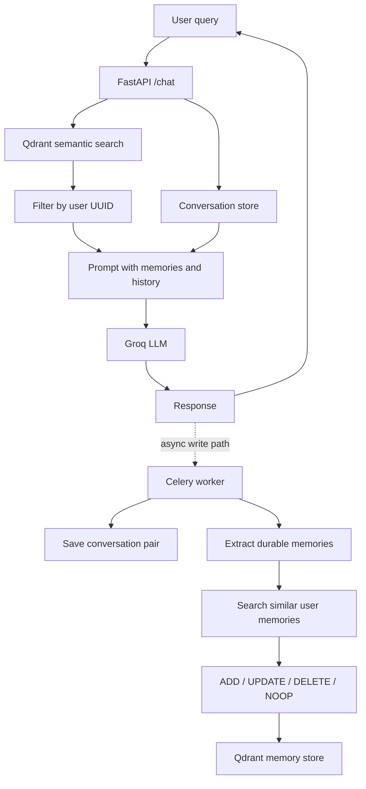

# Mem0-Style Memory Architecture

A full-stack conversational memory prototype inspired by Mem0-style workflows. The system combines a FastAPI chat API, Groq-powered responses, Qdrant semantic memory, UUID-scoped users, and a React/Vite frontend.

The architecture separates memory retrieval from memory extraction:

- **Read path:** retrieve memories relevant to the current query, load the user's conversation history, and generate a response.
- **Write path:** persist the conversation pair, extract durable facts, search for similar memories, and apply add, update, delete, or no-op decisions.

## Architecture



Each Qdrant memory contains a `user_id` payload. Queries are filtered by that value, so asking as Alex cannot retrieve Maya or Jordan's memories. Friendly keys such as `alex` resolve to stable UUIDs in `data/user_ids.json`.

## Repository Layout

```text
backend/
  server.py                    FastAPI application and /chat route
  populate_qdrant.py           Seed Qdrant from data/memory_store.json
  requirements.txt             Python dependencies
  utils/
    qdrant_memory.py           Shared Qdrant client and scoped retrieval
    conversations.py           UUID-aware conversation loading
    llm_call.py                Groq response generation
    workers.py                 Conversation and memory extraction workers
    summary.py                 Conversation summarization
    top_k_messages.py          Recent-message selection

data/
  memory_store.json             Seed memory facts grouped by user
  user_ids.json                 Stable friendly-key to UUID mapping

conversations_store.json        UUID-scoped conversation history
frontend/                       React/Vite chat interface
```

## Requirements

- Python 3.10+
- Node.js and npm
- A Qdrant Cloud collection or self-hosted Qdrant instance
- A Groq API key
- RabbitMQ for the Celery worker path

Create a root `.env` file:

```env
QDRANT_ENDPOINT=https://your-qdrant-endpoint
QDRANT_API_KEY=your-qdrant-api-key
QDRANT_COLLECTION=memories
GROQ_API_KEY=your-groq-api-key
GROQ_MODEL=your-groq-model
TOP_K=10
```

## Backend Setup

```powershell
cd backend
python -m venv venv
.\venv\Scripts\Activate.ps1
pip install -r requirements.txt
```

Populate Qdrant with the sample users and memories:

```powershell
python populate_qdrant.py
```

Start the API from the repository root:

```powershell
$env:PYTHONPATH = (Join-Path (Get-Location) 'backend')
.\backend\venv\Scripts\python.exe -m uvicorn server:app --host 127.0.0.1 --port 8000
```

## Chat API

`POST /chat`

```json
{
  "user_id": "alex",
  "user_message": "What do I like to do?"
}
```

The `user_id` can be a friendly key such as `alex`, `maya`, or `jordan`, or the corresponding UUID. The response is generated using only that user's filtered Qdrant memories and conversation history.

Example response:

```json
{
  "response": "You enjoy building developer tools, learning Spanish, and planning focused work in the morning."
}
```

## Frontend

```powershell
cd frontend
npm install
npm run dev
```

The Vite development server runs at `http://localhost:5173`. Configure `VITE_API_BASE_URL` when the backend is not running at `http://localhost:8000`.

## Worker Path

`backend/utils/workers.py` contains the write-side building blocks for saving message pairs, extracting durable memories with Groq, and finding similar memories through the shared Qdrant client. It expects RabbitMQ at the default Celery broker URL:

```text
pyamqp://guest@localhost//
```

## Notes

- `data/user_ids.json` keeps user UUIDs stable across repeated Qdrant seeding runs.
- Qdrant point IDs are deterministic for a user and memory text, so reseeding upserts instead of duplicating the same facts.
- The shared Qdrant client is global within each Python process. Separate API and Celery processes necessarily have one client each.
- Conversation data is currently stored in `conversations_store.json` for this prototype.
