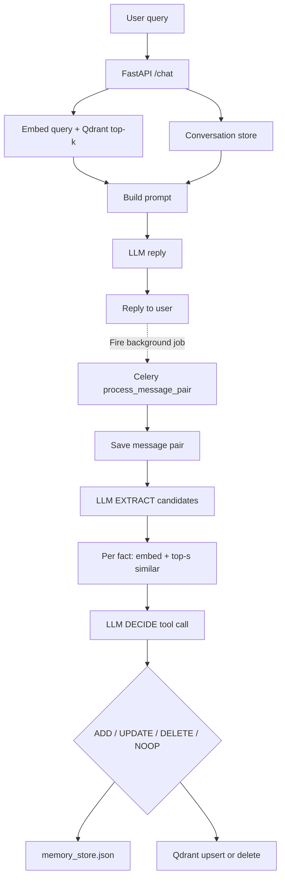

# Mem0-Style Memory Architecture

A full-stack prototype of a **Mem0-style** conversational memory system: hybrid **embeddings (cheap recall) + LLM (judgment)**.

It separates two paths:

| Path | When | What it does |
|------|------|----------------|
| **Read (sync)** | Every `/chat` request | Retrieve top-k memories → build prompt → LLM reply → return to user |
| **Write (async)** | After the reply (Celery) | Save message pair → EXTRACT facts → similar search → DECIDE ADD/UPDATE/DELETE/NOOP → update JSON + Qdrant |

Summary **S** is rebuilt on each write-path EXTRACT from conversation history (no separate periodic summarizer — that is only a scale optimization).

---

## Architecture



### Why embeddings + LLM?

- **Similarity** narrows the store to top-s candidates (cheap recall).
- **LLM DECIDE** judges duplicate vs refine vs contradict vs already known (judgment).
- LLM-only fails at scale (cannot put the whole store in the prompt).
- Similarity-only fails on near-opposite facts (e.g. “likes X” vs “hates X”).

Every Qdrant search is scoped by `user_id`. Friendly keys (`alex`, `maya`, `jordan`) map to stable UUIDs in [`data/user_ids.json`](data/user_ids.json).

---

## Data model

### Memory store (long-term)

[`data/memory_store.json`](data/memory_store.json) holds fact records grouped by user key. Each record:

| Field | Role |
|-------|------|
| `id` | UUID (same as Qdrant point id) |
| `text` | Atomic fact |
| `embedding_vector` | 384-dim MiniLM vector |
| `created_at` / `updated_at` | Timestamps |
| `metadata` | tags, source, user_id |

Qdrant mirrors these points for vector search. **ADD / UPDATE upsert; DELETE removes** the point so the read path stays current without re-seeding.

### Conversation store (short-term)

[`conversations_store.json`](conversations_store.json) stores raw user/assistant turns per UUID. The write path uses:

- **Summary S** — generated with Groq from that user’s history during EXTRACT
- **Last m messages** — typically `m ≈ 10` via `get_top_k_messages`

---

## Repository layout

```text
backend/
  server.py                 FastAPI /chat (read path + .delay write)
  populate_qdrant.py        Seed/recreate Qdrant from memory_store.json
  requirements.txt
  test_memory_ops.py        Smoke tests for apply ops + Qdrant sync
  utils/
    qdrant_memory.py        Client, collection ensure, query_user_memories
    conversations.py        Load conversation history for the prompt
    llm_call.py             Read-path Groq reply
    workers.py              Celery app + full write path
    summary.py              Conversation summary for EXTRACT
    top_k_messages.py       Recent messages for EXTRACT

data/
  memory_store.json         Facts + embeddings by user
  user_ids.json             friendly key → UUID

conversations_store.json    Raw turns by user UUID
frontend/                   React/Vite chat UI
```

---

## Requirements

- Python 3.10+
- Node.js + npm (frontend)
- Qdrant Cloud (or self-hosted) with API access
- Groq API key
- **RabbitMQ** (Celery broker: `pyamqp://guest@localhost//`)

Create a root `.env` (never commit this file):

```env
QDRANT_ENDPOINT=https://your-qdrant-endpoint
QDRANT_API_KEY=your-qdrant-api-key
QDRANT_COLLECTION=memories
GROQ_API_KEY=your-groq-api-key
GROQ_MODEL=llama-3.3-70b-versatile
TOP_K=10
```

---

## Backend setup

```powershell
cd backend
python -m venv venv
.\venv\Scripts\Activate.ps1
pip install -r requirements.txt
```

From the **repository root**, seed Qdrant (recreates the collection and uploads points from `memory_store.json`):

```powershell
$env:PYTHONPATH = (Get-Location)
.\backend\venv\Scripts\python.exe -m backend.populate_qdrant
```

### 1) API (read path)

From the repository root (so both `backend.*` and `utils.*` imports resolve):

```powershell
$env:PYTHONPATH = "$(Get-Location);$(Join-Path (Get-Location) 'backend')"
.\backend\venv\Scripts\python.exe -m uvicorn server:app --host 127.0.0.1 --port 8000 --app-dir backend
```

### 2) Celery worker (write path)

Start RabbitMQ (Docker example):

```powershell
docker run -d --name rabbitmq-mem0 -p 5672:5672 -p 15672:15672 rabbitmq:3-management
```

Then:

```powershell
$env:PYTHONPATH = (Get-Location)
.\backend\venv\Scripts\celery.exe -A backend.utils.workers.app_celery worker --loglevel=info --pool=solo
```

`--pool=solo` is recommended on Windows.

Without a worker, `/chat` still returns a reply, but `process_message_pair.delay(...)` only enqueues work — EXTRACT/DECIDE/apply will not run.

---

## Chat API

`POST /chat`

```json
{
  "user_id": "alex",
  "user_message": "What do I like to do?"
}
```

`user_id` may be `alex` / `maya` / `jordan` or the UUID from `user_ids.json`.

Example response:

```json
{
  "response": "You enjoy building developer tools, learning Spanish, and planning focused work in the morning."
}
```

After responding, the API enqueues:

```text
process_message_pair.delay(user_id, user_message, assistant_reply)
```

---

## Write path (Celery task)

Task: `workers.process_message_pair` in [`backend/utils/workers.py`](backend/utils/workers.py)

1. **Save** user + assistant message pair → conversation store  
2. **EXTRACT** (LLM #1) → candidate facts (summary S + last m turns + new pair)  
3. **For each fact** → similarity search → top-s matches in Qdrant  
4. **DECIDE** (LLM #2) → tool call: `ADD` | `UPDATE` | `DELETE` | `NOOP`  
5. **Apply** → update `memory_store.json` and sync Qdrant (re-embed on ADD/UPDATE)

Call synchronously (no broker) for debugging:

```powershell
.\backend\venv\Scripts\python.exe -m backend.utils.workers
```

Or run smoke tests:

```powershell
.\backend\venv\Scripts\python.exe -m backend.test_memory_ops
```

---

## Frontend

```powershell
cd frontend
npm install
npm run dev
```

Open `http://localhost:5173`. Set `VITE_API_BASE_URL` if the API is not at `http://localhost:8000`.

---

## Learning this codebase (suggested order)

1. [`backend/server.py`](backend/server.py) — read path + `.delay`  
2. [`backend/utils/qdrant_memory.py`](backend/utils/qdrant_memory.py) — scoped retrieval  
3. [`backend/utils/llm_call.py`](backend/utils/llm_call.py) — reply prompt  
4. [`backend/utils/workers.py`](backend/utils/workers.py) — EXTRACT → similar → DECIDE → apply + Qdrant sync  
5. [`backend/populate_qdrant.py`](backend/populate_qdrant.py) — initial seed / recreate collection  

---

## Notes

- Point ids are the memory UUIDs from `memory_store.json` (also stored in payload `id`).
- `populate_qdrant.py` **recreates** the collection before upload so old ids cannot linger.
- Runtime ADD/UPDATE/DELETE do **not** require re-populate; they upsert/delete in Qdrant directly.
- Conversation data is file-based for the prototype (`conversations_store.json`).
- A periodic “async summarizer” is **not** implemented; summary is computed on each write-path EXTRACT.
